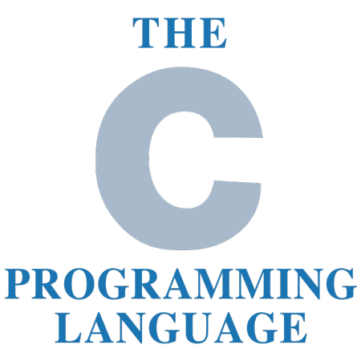
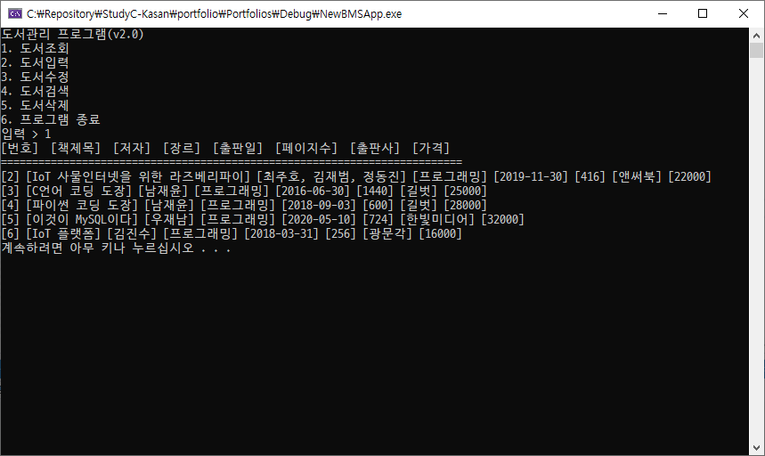
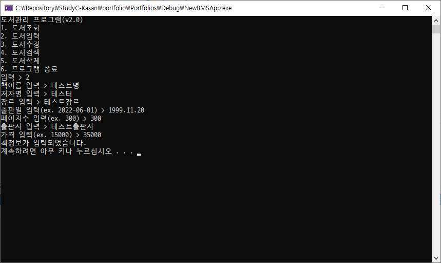

## Study C Basic
C학습 리포지토리

### Day 1
- Visual Studio 2022 Community Edition 설치
- C 기본개념
- C 기본문법
  - 상수와 데이터 출력
  - 변수와 데이터 입력
  - 연산자
  - 선택문
    - if
    - switch

### Day 2
- C 기본문법
  - 반복문
    - while
    - for
  - 함수
  - 배열, 포인터
  - 문자, 문자열
  - 메모리 동적할당
  - (변수, 데이터공유, 다차원 포인터, 응용포인터는 나중에)

### Day 3
- C 기본문법
  - 메모리 동적할당 나머지
  - 파일 입출력
- MySQL DB 학습

### Day 4 ~ 5
- 실습예제
  - 도서관 관리 프로그램(MySQL)
    - MSVC(C)
    - MySQL Connector C 6.1
    - MySQL Server
 

 
### 실행화면

기본 조회화면

<!--  -->

책정보 수정화면
